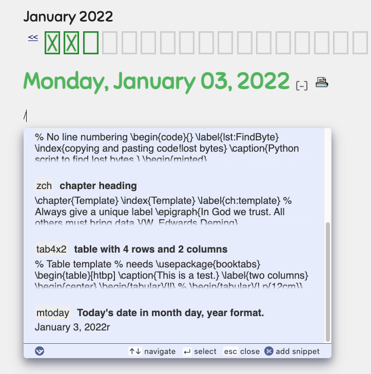
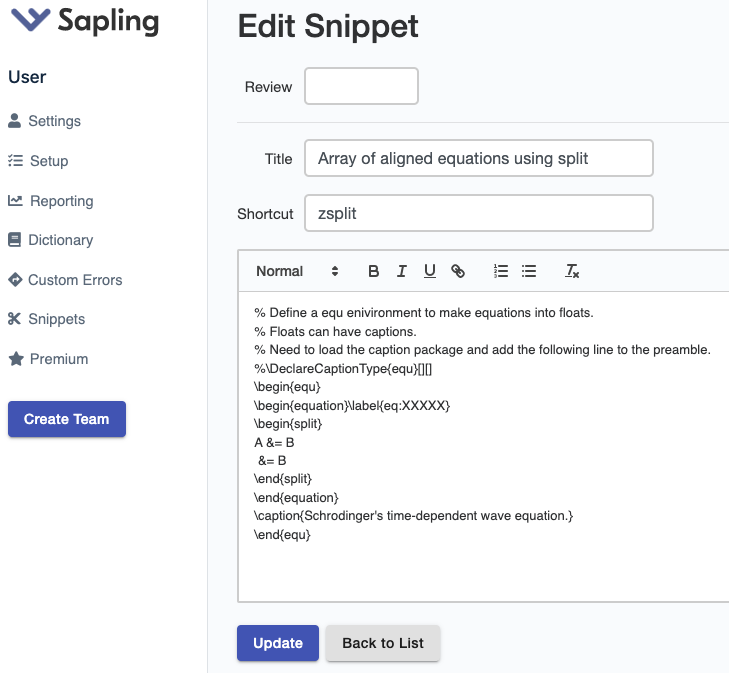
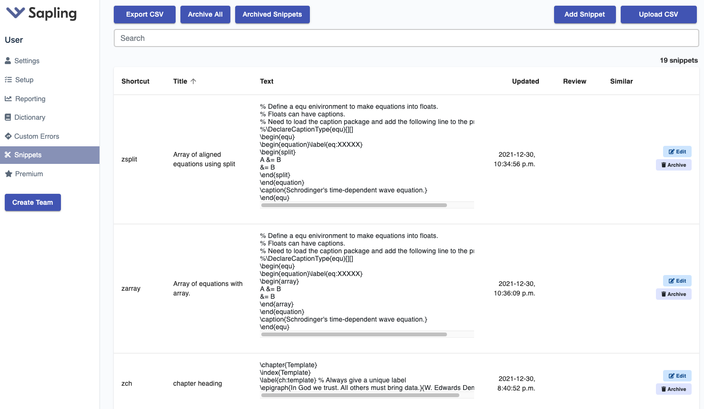

# LaTeX snippets for textareas in webpages

I miss the ability to use snippets of LaTeX code in the textareas of 750words, Overleaf, and other websites.
The problem is now solved via snippets in Sapling.
You can have up to 20 snippets in the free version.
Twenty snippets for LaTeX cover my most frequent needs.

Sapling is a grammar-checker like language-tool and Grammarly.
It is being developed at Stanford.
Sapling is also available as an add-in on MS Word and an extension for .
You may have to turn Sapling on for specific webpage via the Google Extension manager that is shaped like a puzzle piece.

The Sapling snippets have shortcuts rather than tab-triggers.
Type the name of the shortcut, and the code is inserted.
There is no need to enter tab.

However, a shortcut like "ch" for a chapter template is too frequent of a letter sequence.
This leads to unwanted insertions of snippets.
The work around is to rename the above snippet "zch".
The zch letter sequence is not frequent.

Entering a blackslash will bring up a menu that provides access to your list of snippets.
Backslashes are used a lot in LaTeX, so I recommend changing the short to something else like a forward slash, which is rarely used in LaTeX.

The snippets can be interactively entered in a menu in Google Chrome like the one shown above.
You have to use shift-enter to insert a new line character in multi-line snippets.

You can also access the snippet library via the menu for your Sapling account.
After clicking on **Snippets** in the left column, a table like the one above will appear.
Click on the **edit** button to edit a specific snippet.

The collection of snippets can be downloaded in a CSV file.
It may be faster edit the CSV file with a proper text editor to add new multiline snippets and then upload the CSV file via the Sapling menu in Chrome.
I have attached my current collection of snippets in a CV file which you can upload into your Sapling account.

After a change is made to the table of snippets in your Sapling account, you have to reload the webpage to be able to have access to the updated snippets in the text area of the webpage where you are entering text.

I am having trouble with the double insertion of multi-line snippets on Overleaf.
Single line snippets are inserted only once. I have notified Sapling and Overleaf.

The snippets support dates of any format. 
For example, {{ date %Y-%m-%d }} returns the current date in Year-Month-Day format.
